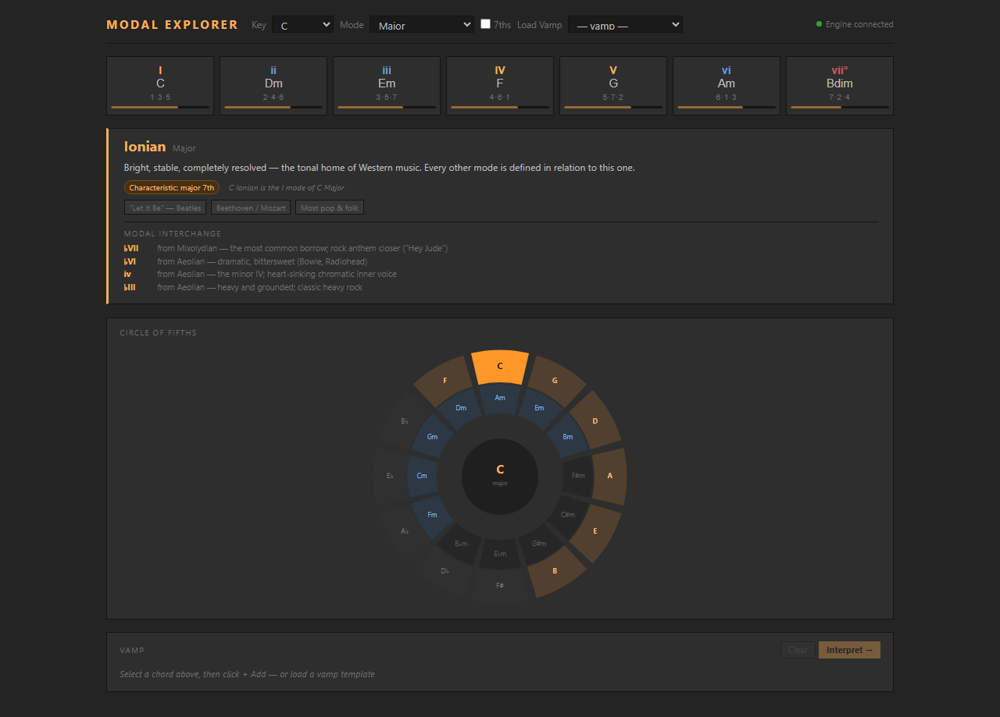

# Composition Aide

A music theory extension for Ableton Live built on the Ableton Extensions SDK (1.0.0-beta.0). Composition Aide adds harmonic intelligence directly into Live's context menus — generate voiced progressions, analyze harmony, explore modes, find compatible clips, and get a per-chord improv guide including upper structure triads and frequency references for spectral work.

All theory operations are handled by a local Python engine that ships **inside the extension** and runs as a subprocess alongside Live. No cloud, no latency, no pip installs.



---

## Requirements

| | |
|---|---|
| **Ableton Live** | A Live build with the **Extensions platform** (currently in closed beta via Centercode). Regular Live releases do **not** include the Extension Host. Not in the beta yet? Ask in the Ableton Discord `#extensions` channel. |
| **Python 3.9+** | The theory engine is pure Python standard library — no packages to install. See per-OS notes below. |

That's it for regular use. Node.js is only needed if you're [building from source](#building-from-source).

---

## Install (the easy way)

1. Download **`Composition-Aide-x.y.z.ablx`** from the [Releases page](https://github.com/saarsena/modal_explorer/releases).
2. Open Live, go to **Settings → Extensions**, and drop the `.ablx` file onto that page.
3. Make sure Python 3 is available (one-time check, see below).
4. Right-click a MIDI clip, clip slot, or scene — the Composition Aide commands appear in the context menu.

### Python check — macOS

Open **Terminal** (Cmd+Space, type "Terminal") and run:

```bash
python3 --version
```

- If it prints a version (3.9 or newer) — you're done.
- If macOS pops up a dialog offering to install **"command line developer tools"** — click **Install**, wait for it to finish (a few minutes, one time only), then restart Live.
- Alternatively, install Python from [python.org](https://www.python.org/downloads/) — the standard installer works fine.

### Python check — Windows

Open **PowerShell** and run:

```powershell
python --version
```

If that fails, install Python from [python.org](https://www.python.org/downloads/) and tick **"Add Python to PATH"** during install (or install Python from the Microsoft Store, which sets up PATH automatically). Then restart Live.

### Troubleshooting

- **Commands appear but do nothing / dialogs show an engine error** → Python isn't on your PATH. Run the version check above in a fresh terminal. If you have Python somewhere unusual, set the `PYTHON_CMD` environment variable to its full path before launching Live.
- **Commands don't appear at all** → your Live build doesn't include the Extension Host, or the extension didn't install. Check **Settings → Extensions** lists Composition Aide.
- **It worked, then stopped after a Python update** → restart Live so the engine subprocess respawns against the new interpreter.

---

## Features

Features are invoked from Live's context menu. All commands are non-destructive unless noted.

### Generate

| Command | Trigger | What it does |
|---|---|---|
| **Generate Progression** | Right-click MIDI track arrangement selection | Pick key, scale, chord template, voicing, and 7ths toggle — or type your own progression as **Roman numerals or chord names** (`ii7 V7 Imaj7`, `bVII`, `V7/ii`, `Dm7 G7 Cmaj7`), with live validation as you type. A **Rhythm** picker applies comping patterns to the output — Charleston, tresillo, pumping 8ths, offbeat skank, boom-chuck, arpeggio and more, with accents and rests — instead of block chords. Writes a fully voiced progression across selected MIDI tracks. |
| **Fill Clip with Progression** | Right-click MIDI clip | Same dialog as Generate (including custom Roman numeral input), but fills an existing clip rather than creating a new one. |
| **Insert Chord** | Right-click session clip slot | Opens the Chord Palette: all diatonic chords for Live's current Key/Scale, triads and 7ths tabs, 12 scale types, dynamic grid. Pick length, octave, and voicing then click Insert. |
| **Generate Bass Line** | Right-click MIDI clip | Recognizes the chords in the clip and writes a bass clip that follows them to the first empty MIDI slot. Seven patterns — held roots, root–fifth, pumping 8ths, octave 8ths, walking (with chromatic approach into each chord change), tresillo, offbeat skank — in three registers. |
| **Compose Song Form** | Right-click scene | Full song-structure workbench: build a list of sections (Verse, Chorus, Bridge…) each with its own bars, key/scale, progression (template or custom Roman numerals), rhythm pattern, and bass pattern. Writes **one new scene per section** below the clicked scene — chord clip + optional bass clip, colored by key — so launching scenes top-to-bottom performs the song. Ships with form presets: Verse–Chorus, AABA, 12-bar blues, EDM arc, lo-fi vamp set. |

### Explore

| Command | Trigger | What it does |
|---|---|---|
| **Modal Explorer** | Right-click session clip slot | Full browser-based theory workbench. Chord grid, Circle of Fifths, progression builder with drag-to-reorder, auto-analysis, 12 template presets, and a mode card for every scale — with **Modal Interchange** suggestions showing borrowed chords and their character. Defaults to Live's current key on open. In session view, a **Write to Clip** button writes the voiced progression directly into the slot. |

### Analyze

| Command | Trigger | What it does |
|---|---|---|
| **Analyze Harmony** | Right-click MIDI clip | Recognizes chords, infers key, shows Roman numerals with tension indicators, and suggests substitutions you can apply in one click. Includes a **Solo Map** (see below) for every chord in the progression. |
| **Find Compatible Clips** | Right-click MIDI clip | Scans the entire session for clips in harmonically related keys (same, relative, dominant, subdominant, parallel). Shows compatibility relationships with circle-of-fifths color swatches. Also generates ready-made progressions in related keys — click **Write →** on any suggestion to write it as a new MIDI clip into the first empty slot. |
| **Map Session Keys** | Right-click scene | Scans all MIDI clips and shows a color-coded key grid (tracks × scenes). Mismatched clips are outlined. Useful before a live set to audit harmonic consistency. |

### Transform

| Command | Trigger | What it does |
|---|---|---|
| **Optimize Voice Leading** | Right-click MIDI clip | Re-voices all chords in the clip using smooth voice leading (minimal pitch movement). Preserves durations, velocities, and non-chord notes. |
| **Snap to Key** | Right-click MIDI clip | Infers the clip's key, removes out-of-key notes. Uses a pitch-class histogram fallback for purely melodic clips. |
| **Snap to Scale** | Right-click MIDI clip | Snaps note pitches to any of 12 named scales — a gentler alternative to Snap to Key that moves notes to the nearest scale degree rather than deleting them. |
| **Transpose Selected Clips** | Right-click multi-selected clip slots | Semitone picker (−24 to +24) with one-click presets. Shifts all notes in every selected clip. |
| **Transpose Session** | Right-click scene | Transposes all MIDI clips in the session by a chosen interval, with an option to re-color clips by the new keys. |

### Label & Color

| Command | Trigger | What it does |
|---|---|---|
| **Color Clips by Key** | Right-click scene | Writes `clip.color` on every MIDI clip using the circle-of-fifths color system. Bakes a key map into session view — no modal needed. |
| **Label Clip Key** | Right-click MIDI clip | Appends the inferred key to the clip name, e.g. `"Loop 1 [Am]"`. |
| **Label All Clip Keys** | Right-click scene | Same as Label Clip Key but applied to every MIDI clip in the session in one pass. |

---

## Solo Map

When you run **Analyze Harmony**, every chord in the progression gets a Solo Map entry showing:

- **Scale/mode** recommendation with a one-line rationale
- **Chord tones** with exact frequencies in Hz (octave 4, close position above the root)
- **Lean on** — the characteristic interval for that mode, also in Hz

For **dominant 7th chords**, the Solo Map expands with an **Upper Structures** section — four major triads you can superimpose over the dominant for different harmonic colors:

| UST | Sound | Extensions |
|---|---|---|
| II | Lydian dominant | 9 · #11 · 13 |
| ♭V | Altered dominant | ♭5 · 7 · ♭9 |
| ♭II | Phrygian dominant | ♭9 · 11 · ♭13 |
| ♭VI | Dark altered | ♭13 · R · ♭9 |

Each upper structure triad shows its three note names and Hz values — useful as frequency targets for spectral synthesis, additive patches, or harmonic effects in Max/MSP or similar environments.

---

## Building from source

Only needed if you want to hack on the extension. If you just want to use it, [install the `.ablx`](#install-the-easy-way) instead.

### Prerequisites

- Everything from [Requirements](#requirements) above
- **Node.js ≥ 24.14.1** — check with `node --version`, download from [nodejs.org](https://nodejs.org)
- **The Extensions SDK zip** from Centercode — you need the two `.tgz` packages inside it
- **Developer Mode enabled in Live** — Settings → Extensions → Developer Mode (required for `npm start` to connect)

### Step 1 — Get the repo

```bash
git clone https://github.com/saarsena/modal_explorer
cd modal_explorer
```

### Step 2 — Install dependencies

`npm install` needs the two SDK packages that came with your Centercode download. When you extracted the SDK zip, they're sitting in the root of that folder:

```
extensions-sdk-1.0.0-beta.0/        ← the folder you extracted from Centercode
  ableton-extensions-sdk-1.0.0-beta.0.tgz
  ableton-extensions-cli-1.0.0-beta.0.tgz
  ...
```

Copy both `.tgz` files into the repo folder (next to `package.json`), then open `package.json` and point the two file references at them:

```json
"@ableton-extensions/sdk": "file:./ableton-extensions-sdk-1.0.0-beta.0.tgz",
"@ableton-extensions/cli": "file:./ableton-extensions-cli-1.0.0-beta.0.tgz"
```

Then run:

```bash
npm install
```

### Step 3 — Tell the runner where Live is

`ExtensionHostNodeModule.node` is a file that ships **inside Ableton Live** (not the SDK). The path depends on your OS:

- **Windows:** `C:\ProgramData\Ableton\Live 12 Beta\Program\ExtensionHost\ExtensionHostNodeModule.node`
- **Mac:** inside the Live app bundle, typically `/Applications/Ableton Live 12 Beta.app/Contents/Frameworks/ExtensionHostNodeModule.node` — if you're unsure, run `find /Applications -name "ExtensionHostNodeModule.node"` in Terminal.

Copy the example config file and set that path:

```bash
# Mac / Linux
cp .env.example .env

# Windows (PowerShell)
Copy-Item .env.example .env
```

Open `.env` and set `EXTENSION_HOST_PATH`:

```
# Windows example
EXTENSION_HOST_PATH=C:\ProgramData\Ableton\Live 12 Beta\Program\ExtensionHost\ExtensionHostNodeModule.node

# Mac example
EXTENSION_HOST_PATH=/Applications/Ableton Live 12 Beta.app/Contents/Frameworks/ExtensionHostNodeModule.node
```

### Step 4 — Run it

Make sure Live is open and Developer Mode is on, then from the repo folder:

```bash
npm start
```

This builds the extension and loads it into Live. You'll see the Composition Aide commands appear in Live's context menus.

> **Stuck?** The most common issues: (1) wrong `EXTENSION_HOST_PATH` — double-check the path exists and you saved `.env` not `.env.example`; (2) Developer Mode is off — check Settings → Extensions; (3) Node.js version too old — `node --version` should be ≥ 24.14.1.

> **FYI:** While the extension is running, you can open `src/theory-machine.html` directly in your browser. It connects to the local theory engine automatically and works as a full standalone web app — nice to have open on a second screen while you work in Live.

### Scripts

| Script | What it does |
|---|---|
| `npm run build` | Type-check + bundle → `dist/extension.js` (dev: sourcemaps, unminified) |
| `npm start` | Build + launch in Live's Extension Host |
| `npm run package` | Production build + create the distributable `.ablx` (includes the `engine/` Python files) |

`npm run package` writes `Composition-Aide-<version>.ablx` to the repo root — that's the file to share. The version comes from `manifest.json`.

### Environment overrides

| Variable | Default | Purpose |
|---|---|---|
| `COMPOSITION_AIDE_PATH` | `engine/` (bundled) | Point the extension at a different Python engine directory during development |
| `PYTHON_CMD` | `python3` (Mac/Linux), `python` (Windows) | Use a specific Python interpreter or full path |

---

## The Python Engine

The `engine/` directory contains the full theory engine — pure Python stdlib, no pip dependencies. It is bundled into the `.ablx`, runs as a persistent subprocess alongside Live, and handles all music theory computations over a newline-delimited JSON-RPC protocol on stdin/stdout.

**Files:**

| File | Purpose |
|---|---|
| `chordgen/server.py` | JSON-RPC server — spawned by the extension |
| `chordgen/__init__.py` | Public API surface for the server |
| `music_theory.py` | Core primitives: notes, intervals, scales, chords |
| `analyzer.py` | Key inference, Roman numeral analysis, substitution suggestions |
| `voicing.py` | Close, drop2, shell, and smooth voice-leading strategies |
| `songform.py` | Chord template expansion (I–V–vi–IV, 12-bar blues, etc.) |
| `upper_structures.py` | Upper structure triad logic |

Operations used by the extension:
- `op_progression` — generate chord progressions from key/scale/template
- `op_voice_progression` — voice a chord list with close, drop2, or smooth strategy
- `op_recognize_chord` — identify a chord from a set of MIDI pitch classes
- `op_analyze` — infer key, compute Roman numerals, suggest substitutions
- `op_diatonic` — all diatonic chords for a given key and scale
- `op_voicings` — close/drop2/shell voicing for a named chord

---

## Architecture

```
Ableton Live
  └── Extension Host (Node.js)
        ├── extension.ts      — 15 commands + context menu registrations
        ├── engine.ts         — ChordgenEngine: subprocess JSON-RPC client
        └── src/*.html        — self-contained modal dialogs, bundled as strings
              │
              └──send()──▶  chordgen/server.py  (Python, stdin/stdout JSON-RPC)
                                  └── music theory ops
```

`engine.ts` spawns the Python process on first use, keeps it alive for the session, and multiplexes concurrent requests by `id` — so `Promise.all` across multiple `engine.send()` calls is safe.

Each HTML modal is a fully self-contained file bundled into `dist/extension.js` at build time. Data is injected via `.replace("__TOKEN__", safeJson(data))` before the `data:text/html,…` URL is passed to `showModalDialog`. Results come back as JSON via `closeWithResult(result)`.

---

## Color System

Keys are colored by circle-of-fifths position:

```
C  = 0°    G  = 30°   D  = 60°   A  = 90°
E  = 120°  B  = 150°  F# = 180°  D♭ = 210°
A♭ = 240°  E♭ = 270°  B♭ = 300°  F  = 330°
```

Major keys: saturation 70%, lightness 45%.  
Minor keys: saturation 55%, lightness 35% (darker).

Packed as `0x00RRGGBB` integers for `clip.color`.

---

## License

[MIT](LICENSE) © 2026 saarsena
